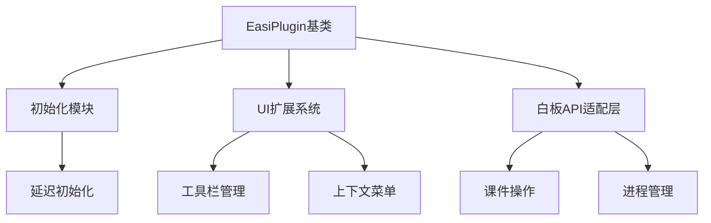

# EasiPlugin.Sample 项目分析报告

## 项目概述
希沃白板原生插件开发示例项目，基于.NET 6和WPF技术栈，提供与希沃白板深度整合的扩展能力。项目包含完整的插件开发样板代码，演示以下核心功能：

- 工具栏菜单项扩展
- 画板元素操作API使用
- 多语言本地化支持
- 插件安装包构建配置
- 埋点事件上报机制
- 白板进程生命周期管理

## 核心特性

### 1. 插件架构
```csharp
// Program.cs 插件入口
class Program : dotnetCampus.EasiPlugins.EasiPlugin
{
    protected override Task OnRunningAsync()
    {
        // 初始化逻辑
        ExportUIItems();
        return Task.CompletedTask;
    }
}
```
- 继承自`EasiPlugin`基类
- 支持云课件模式(IsCloud)判断
- 延迟初始化机制确保白板就绪

### 2. UI扩展系统
```csharp
// 工具栏菜单项注册
manager.AppendWithLang(new EasiPluginSampleElementToolMenuItem(),
    new UIItemAttribute(UIItemPurposes.BoardEditMenu), new[]
    {
        new UIItemLangInfo(new CultureInfo("zh-CHS"), "演示工具")
    });
```
- 支持多层级菜单扩展
- 提供HeadToolBar/ElementEditMenu等多种插入位置
- 内置多语言自动适配机制

### 3. 白板元素操作
| 对象类型       | 功能描述                     | 典型API                          |
|----------------|------------------------------|----------------------------------|
| Slide          | 页面管理                     | EN.EditingBoardApi.CurrentSlide  |
| TextElement    | 文本元素操作                 | GetRunBoundsByDocumentOffset()   |
| GroupElement   | 组合元素处理                 | Elements.OfType<GroupElement>()  |
| StorageModel   | 课件存储模型                 | GetStorageModelAsync()           |

### 4. 构建与部署
```xml
<!-- 项目配置示例 -->
<PropertyGroup>
    <UseEasiNote>most</UseEasiNote>
</PropertyGroup>
```
- 支持多种部署格式：
  - EXE安装包（.NET Framework）
  - ENPX独立部署包（.NET 6）
  - 应用中心分发包（ENP/ZIP）
- NuGet本地包源配置
- SDK版本兼容性管理

## 开发指南

### 环境要求
- Visual Studio 2022 17.5.2+
- 希沃白板5.2.4.8298+
- Windows 10 x64

### 典型工作流
1. 通过`EN.CommandOptions`判断运行模式
2. 注册UI扩展项并配置多语言
3. 监听白板事件（如PPTX转换完成）
4. 通过`EN.EditingBoardApi`操作课件元素
5. 使用`SafeEN.Collection.ReportEvent`上报埋点
6. 构建生成安装包

## 架构设计


## 最佳实践
1. **线程安全**：通过`Dispatcher.InvokeAsync`访问UI资源
2. **错误处理**：使用`ShellFlowHelper.EnsureShutdown`优雅退出
3. **性能优化**：对批量元素操作使用异步处理
4. **兼容性**：通过`EN.App.IsReady`检查白板状态
5. **可维护性**：使用独立的Lang类管理多语言资源

## 扩展开发示例
```csharp
// 自定义存储提供程序
public class CustomStorageProvider : ISaveInfoProvider
{
    public Task SaveAsync(StorageModel model)
    {
        // 自定义存储逻辑
    }
}

// 注册自定义组件
InterfaceCreator.Register<ISaveInfoProvider>(_ => new CustomStorageProvider());
```

[项目仓库](https://github.com/EasiNote/EasiPlugin.Sample) | [API文档](https://github.com/EasiNote/EasiNote.ClientWebApi.Documentation)
